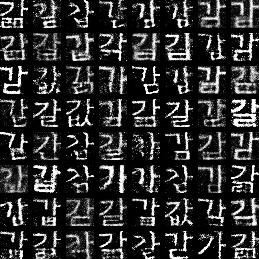

## GAN
> Forked from [GAN-tensorflow](https://github.com/ckmarkoh/GAN-tensorflow)

Implementation of [Generative Adversarial Networks](https://arxiv.org/abs/1406.2661) by Tensorflow, 
with [phd08](https://www.dropbox.com/s/69cwkkqt4m1xl55/phd08.alz?dl=0)

## Requirements

 - [Tensorflow](http://www.tensorflow.org/)

## Examples

### Change Log


### Final Result

- max_epoch : 500

- batch_size : 256



## Run

### train

```
python gan.py
```

### test

> after train, change `to_train` from `True` to `False`

```
python gan.py
```